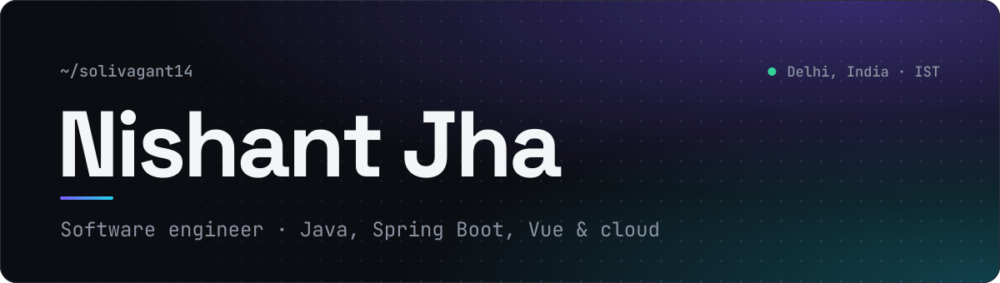
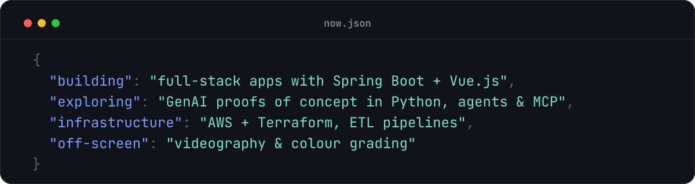
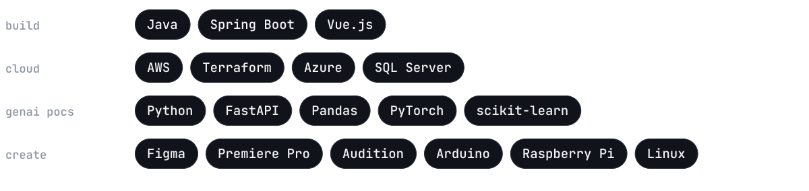

<picture>
  <source media="(prefers-color-scheme: dark)" srcset="assets/banner-dark.svg">
  <source media="(prefers-color-scheme: light)" srcset="assets/banner-light.svg">
  
</picture>

I build full-stack web apps and the systems behind them. Lately that means Java and Spring Boot on the back end, Vue.js on the front, and AWS with Terraform for infrastructure. When an idea needs proving fast, I reach for Python and spin up a GenAI proof of concept.

<picture>
  <source media="(prefers-color-scheme: dark)" srcset="assets/now-dark.svg">
  <source media="(prefers-color-scheme: light)" srcset="assets/now-light.svg">
  
</picture>

<picture>
  <source media="(prefers-color-scheme: dark)" srcset="assets/divider-dark.svg">
  <source media="(prefers-color-scheme: light)" srcset="assets/divider-light.svg">
  
</picture>

### Stack

<picture>
  <source media="(prefers-color-scheme: dark)" srcset="assets/stack-dark.svg">
  <source media="(prefers-color-scheme: light)" srcset="assets/stack-light.svg">
  
</picture>

### Find me

[LinkedIn](https://www.linkedin.com/in/nishantjha14/) &nbsp;·&nbsp; [X](https://twitter.com/slvgnt14) &nbsp;·&nbsp; [Instagram](https://www.instagram.com/_nishant.jha/) &nbsp;·&nbsp; [Stack Overflow](https://stackoverflow.com/users/16754582)
